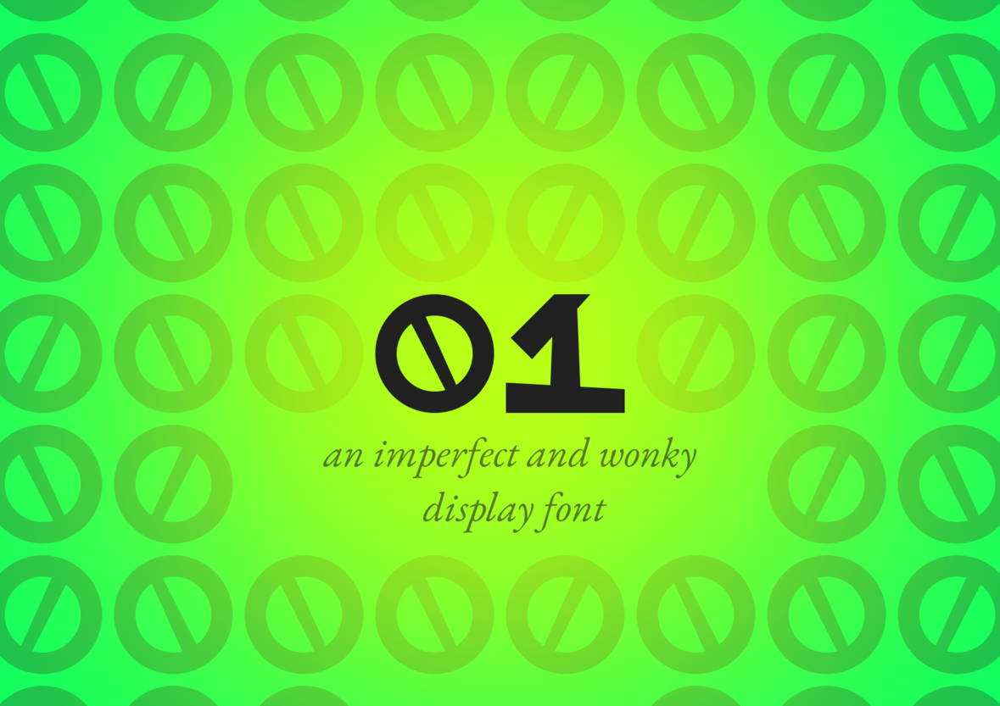
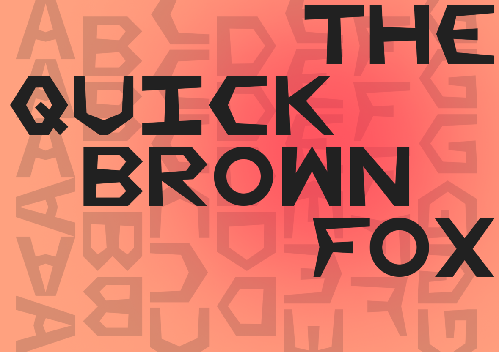
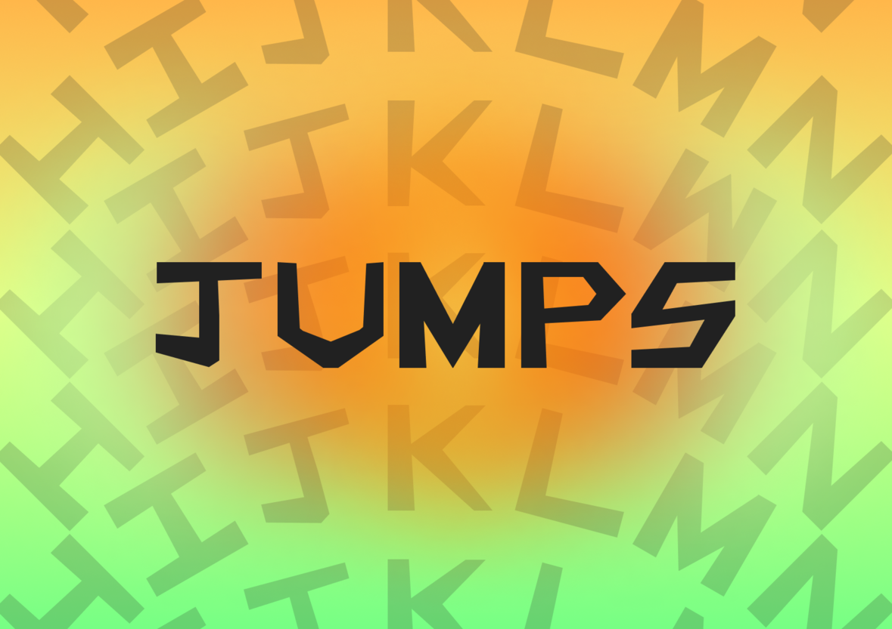
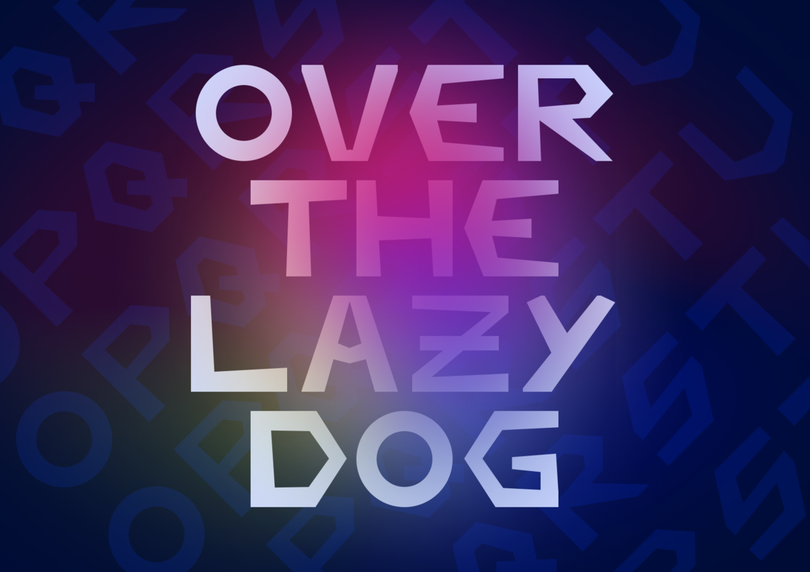
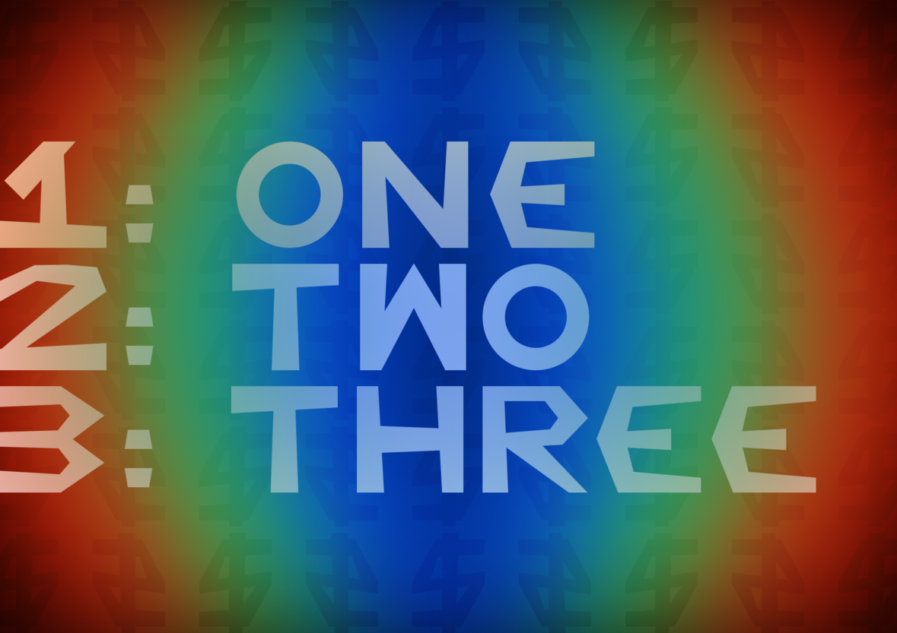
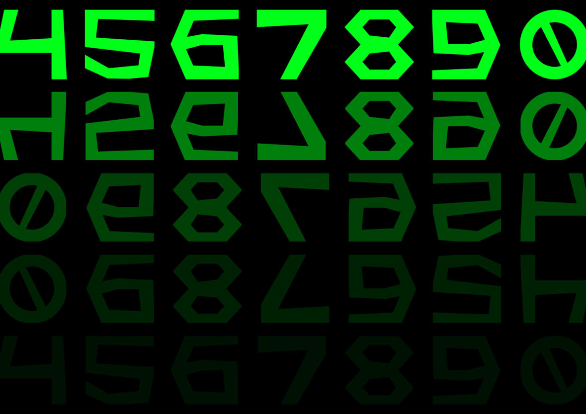
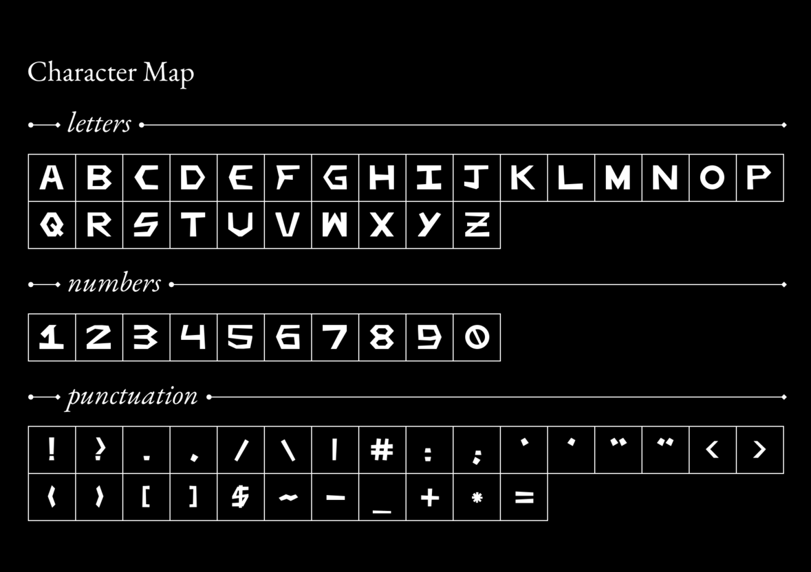

This was an attempt at creating a font. It is, rather clearly, wonky,
very much so. However, given its status as a first attempt, I gave
myself that margin. I wanted to make *something*. *Something* did I
make. Here it is:

 
 
 

If you'd like to view this stuff in higher resolution, take a look at
this project on
[Behance](https://www.behance.net/gallery/173288893/01-An-Imperfect-and-Wonky-Display-Font).

If you have any thoughts, feel free to leave them in a comment below.
Have a nice day!
